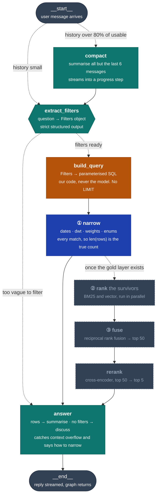

# Ocean-Intelligence-

Data pipeline for the SMU IS483 capstone with Cargill Ocean Transportation. An Excel file placed in the bronze S3 bucket is automatically transformed into cleaned JSON in the silver bucket, where it becomes available to the dashboard and chatbot.

This repository covers the bronze-to-silver data layer, the chat agent that queries it, and the gold-layer embedding columns that back future semantic ranking. The rest of the RAG components (BM25, fusion, reranking) are maintained elsewhere.

Status: deployed and verified end to end.

## What it does

```
Excel upload → EventBridge → SQS → Lambda → Glue → JSON in silver
                (filters)  (queues)  (selects)  (transforms)
```

An `.xlsx` file placed in `bronze-ocean-layer` triggers an S3 notification. EventBridge filters for the `.xlsx` suffix and forwards the event to an SQS queue. A Lambda function consumes the queue, waiting up to 60 seconds so that a multi-file upload produces a single invocation.

The Lambda determines what work is outstanding by listing every `.xlsx` object in the bucket and checking each against a DynamoDB ledger of processed files. It passes the remainder to Glue, which transforms them and writes `orders.json` and `tonnage.json` to `silver-ocean-layer`, then records the processed files in DynamoDB.

The Lambda discards the queue message contents and re-derives its file list from the bucket on every invocation, making the bucket the single source of truth. Lost, duplicated, or out-of-order messages cannot affect correctness. A scheduled rule invokes the same function daily at 06:00 SGT as a fallback.

Files are tracked by S3 path combined with object ETag, so replacing a file at an existing path is correctly treated as new work.

## Current capabilities and limits

**Any number of files per run.** Every unprocessed file is passed to a single Glue run. No cap exists at any point in the pipeline.

**One Glue run at a time.** Files uploaded during a run are not processed immediately. The Lambda detects the running job, raises, and the SQS message is retried after 420 seconds until Glue is available. After 10 retries, approximately 70 minutes, the message moves to the dead-letter queue. Glue's job timeout is 60 minutes, leaving a narrow margin under sustained load.

**Near-real-time for single uploads.** Worst-case latency from upload to Glue start is roughly 60 seconds, plus Glue's cluster provisioning time of about a further 60 seconds.

**Output volume.** `orders.json` holds 1864 records across 15 fields; `tonnage.json` holds 11105 records across 16 fields, covering 1037 unique vessels.

## Data caveats

**Vessel-to-order links are synthetic.** The tonnage source contains no Order ID column, and no relationship between vessels and orders exists in the source data. `assign_order_ids` generates this relationship artificially, assigning each vessel an `order_id` from the orders pool solely to permit the two tables to be joined. These are not real Cargill fixtures, and any feature presenting them as genuine vessel matches is displaying fabricated data.

**Two required columns contain no data.** `assigned` and `assigned_vessel_name` are 100% null; `commercial_status` is 79.2% null. These are deficiencies in the source workbooks rather than pipeline defects, and both affect core deliverables — vessel-order matching and US-2.2 respectively.

**Date coverage differs.** Tonnage extends to 2026-04-21, orders only to 2026-01-06. Time-based joins will produce a three-month period containing vessels but no orders.

## Silver → gold: embeddings

```
orders.json / tonnage.json in silver → EventBridge → Lambda → public.orders / public.tonnage (every silver column + *_embedding columns)
```

This is the silver → gold loader: every column in the silver JSON is upserted
into the matching Supabase table, and each column that can't be filtered in
SQL — comma-packed sets like `load_zone` and `parent_zone`, free text like
`cargo_description` and `destination` — gets a matching `<column>_embedding`
sibling column computed with Cohere (`embed-english-v3.0`, 1024-dim). Orders
has 15 silver columns, 6 of them embedded, so gold has 21 data columns; tonnage
has 16 silver columns, 6 embedded, so gold has 22. This is the piece the chat
agent's roadmap calls "the gold layer"; ranking, fusion and reranking on top
of these columns are still maintained elsewhere.

Primary keys match the silver file's own row identity. `orders.order_id` is
used as-is. A tonnage row is a reported *position*, not a vessel (11,105 rows
/ 1,037 vessels), so `vessel_id` alone isn't unique — gold's primary key is
`(vessel_id, open_date_start, open_date_end, first_date_received)`, exactly
`glue_transform.py`'s own dedup key for the tonnage silver file. Checked
against the real source workbook: none of those 4 columns are ever null, and
there are exactly 11,105 distinct combinations, matching the published row
count.

`smu-gold-embeddings` (`scripts/gold_embeddings/embed_lambda.py`) fires on the
same EventBridge "Object Created" pattern as the bronze trigger, but directly
on the silver bucket (`.json` suffix, no SQS — each file write is independent,
nothing to batch). Every row's base columns are upserted every run — cheap and
idempotent — but embeddings are not, so each row's `embedding_hashes` column
tracks a `{column: sha256}` map and Cohere is only called for columns whose
hash actually changed, so a Glue run that only touched a few hundred rows
doesn't re-embed the whole table. The very first run has to backfill ~13,000
existing rows' embeddings, which doesn't fit in one Lambda invocation: the
handler tracks its own remaining time and re-invokes itself asynchronously
with the same event when it runs low, which naturally terminates because
already-embedded rows stop showing up as "changed."

**One-time setup**, before the Lambda's first run:
```
psql "$SUPABASE_DB_URL" -f scripts/setup_gold_embeddings.sql
```
Enables `pgvector` and adds the embedding + `embedding_hashes` columns to both
tables (idempotent — safe to re-run).

**Deploying the Lambda** needs a packaged zip, since it depends on `pg8000`
(unlike `smu-daily-trigger`, which is pure stdlib + boto3 and ships inline in
the CloudFormation template):
```
pip install -r scripts/gold_embeddings/requirements.txt -t build/
cp scripts/gold_embeddings/embed_lambda.py build/
(cd build && zip -r ../gold-embeddings-lambda.zip .)
```
Upload the zip to S3 and pass its bucket/key as `EmbeddingLambdaS3Bucket` /
`EmbeddingLambdaS3Key`, plus `SupabaseDbUrl` and `CohereApiKey`, when deploying
`infra/smu_daily_pipeline.yaml`.

Like the bronze bucket, EventBridge notifications must be enabled manually on
`silver-ocean-layer` (Properties → Event notifications → Amazon EventBridge →
Edit → On) — the stack does not own the bucket.

Cohere's API key goes in `.env` as `COHERE_API_KEY` for local runs, and as the
`CohereApiKey` stack parameter for the deployed Lambda.

## The chat agent

A LangGraph agent over `public.orders` and `public.tonnage`, served by Chainlit at `/chat`. Stage one only — metadata filtering. Ranking and reranking wait for the gold layer.



Solid arrows are fixed edges, dotted are conditional or not yet built. Teal is a model call, blue a database operation, amber deterministic code. **The three greyed boxes do not exist yet** — `narrow` hands straight to `answer` today.

Steps ①②③ will be one SQL statement, drawn as three boxes because they are three distinct operations. `narrow` runs first and both rankers only ever see its output.

**`compact`** summarises everything but the last six messages so history stops growing. Conditional, because it costs a model call.

**`extract_filters`** turns the question into a typed `Filters` object using strict structured outputs. The only place untrusted output enters the pipeline, so every failure mode is handled here and nothing downstream needs to.

**`build_query`** compiles that object into parameterised SQL. Our code, never the model — a bad extraction returns wrong rows, it cannot execute anything.

**`narrow`** runs the statement. There is no `LIMIT`, so the row count is the true number of matches.

**`answer`** has three paths: summarise the rows, report an error, or — when nothing filterable was named — answer from the conversation instead of the database.

Two routers, both plain functions that call no model:

| Router | Sits on | Decides |
|---|---|---|
| `route_entry` | `START` | `compact` when history passes 80% of usable context, else `extract_filters` |
| `route_after_extract` | `extract_filters` | `answer` on a clarification or an error, else `build_query` |

### Limits

| Limit | Detail |
|---|---|
| Filterable fields | Tonnage: vessel ids, open/ETA/updated/received windows, dwt, ballast or laden, commercial status. Orders: order ids, laycan, received, updated, cargo weight |
| Not filterable | Region, port, zone, open area, destination, cargo type, cargo description, ship type, vessel status. All are shown in the results panel, which filters per column |
| Combining conditions | AND only. No OR and no negation, so "fixed or on subs" and "everything except fixed" cannot be asked |
| Enum arity | `ballast_laden` and `commercial_status` take one value; ids take a list |
| Result size | Beyond roughly 950 rows the model's context is exceeded and the query fails with a message asking you to narrow. One month of tonnage is about 1,000 rows |
| Aggregation | None. No `GROUP BY`, no averages, no top-N |
| Joins | One table per question. `tonnage.order_id` matches no rows in `orders`, so cargo-to-vessel matching is not available |
| Row meaning | A tonnage row is a reported position, not a vessel — 11,105 rows cover 1,037 vessels |
| Memory | Retrieved rows do not survive the turn. Follow-ups re-query rather than recall, so "show me the third one" has no list to index |
| Relative dates | The extraction prompt carries no current date, so "next month" is guessed rather than computed |

## Deployment

```
scripts/glue_transform.py                ← bronze → silver transformation logic
scripts/gold_embeddings/embed_lambda.py  ← silver → gold embedding logic
scripts/setup_gold_embeddings.sql        ← one-time pgvector + column setup
infra/smu_daily_pipeline.yaml            ← Lambdas, queues, Glue job, DynamoDB table
```

Changes to the transformation logic require only re-uploading `glue_transform.py` to `s3://bronze-ocean-layer/scripts/`. Changes to the embedding logic require rebuilding and re-uploading the `gold-embeddings-lambda.zip` described above. Infrastructure changes require deploying the CloudFormation stack with `CAPABILITY_NAMED_IAM`, supplying `BronzeBucketName`, `SilverBucketName`, `GlueScriptS3Uri`, `EmbeddingLambdaS3Bucket`, `EmbeddingLambdaS3Key`, `SupabaseDbUrl`, and `CohereApiKey`.

EventBridge notifications must be enabled manually on the bronze *and* silver buckets via S3 → Properties → Event notifications → Amazon EventBridge → Edit → On. CloudFormation cannot apply this because the stack does not own either bucket. If a bucket is recreated the setting must be reapplied, or uploads/writes to it will generate no events and rely on the daily schedule (bronze only — the gold embeddings stage has no scheduled fallback, since it's driven off silver writes rather than uploads).

If files cease to be processed, examine the dead-letter queue `smu-daily-trigger-uploads-dlq` first. If embeddings stop updating, check the `smu-gold-embeddings` CloudWatch Logs group — it has no DLQ, since EventBridge invokes it directly.

Account `FYP_oceanAI` (334298574595), region `us-east-1`, stack `smu-daily-pipeline`.

| Resource | Name |
|---|---|
| DynamoDB | `smu-processed-files` |
| Glue job | `smu-glue-transform` |
| Lambda | `smu-daily-trigger`, `smu-gold-embeddings` |
| SQS / DLQ | `smu-daily-trigger-uploads`, `-dlq` |
| EventBridge | `smu-daily-trigger-on-upload`, `-schedule`, `smu-gold-embeddings-on-upload` |


The principal scaling constraint is that each silver table is a single JSON object, requiring read-modify-write on every update, which is what necessitates one concurrent Glue run. Migrating silver to RDS PostgreSQL, already in the project proposal, removes this constraint.