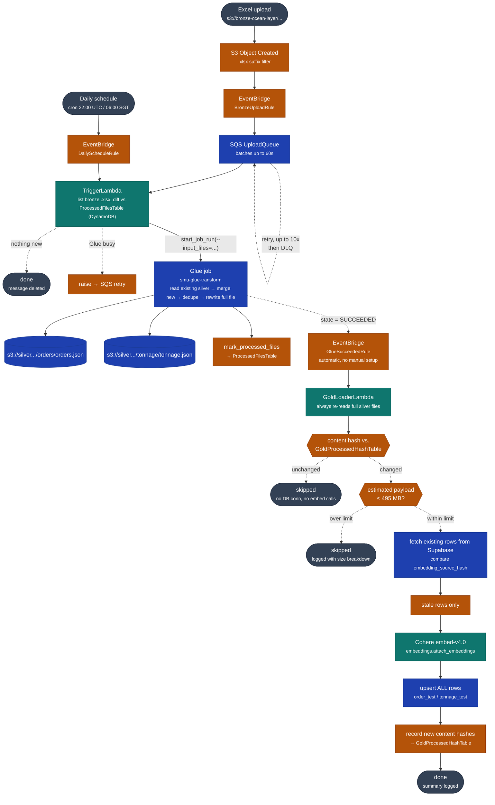

# Ocean-Intelligence-

Data pipeline for the SMU IS483 capstone with Cargill Ocean Transportation. An Excel file placed in the bronze S3 bucket is automatically transformed into cleaned JSON in the silver bucket, then embedded and loaded into Supabase gold tables, where it becomes available to the dashboard and chatbot.

This repository covers the bronze-to-silver-to-gold data layers and the chat agent that queries the gold tables. The RAG components are maintained elsewhere.

Status: deployed and verified end to end.

## What it does

```
Excel upload → EventBridge → SQS → Lambda → Glue → JSON in silver
                (filters)  (queues)  (selects)  (transforms)

Glue SUCCEEDED → EventBridge → Lambda → Cohere embeddings → Supabase gold
                                (reads)   (embeds new/changed) (upserts)
```

### Bronze → Silver

An `.xlsx` file placed in `bronze-ocean-layer` triggers an S3 notification. EventBridge filters for the `.xlsx` suffix and forwards the event to an SQS queue. A Lambda function consumes the queue, waiting up to 60 seconds so that a multi-file upload produces a single invocation.

The Lambda determines what work is outstanding by listing every `.xlsx` object in the bucket and checking each against a DynamoDB ledger of processed files. It passes the remainder to Glue, which transforms them and writes `orders/orders.json` and `tonnage/tonnage.json` to `silver-ocean-layer`, then records the processed files in DynamoDB.

The Lambda discards the queue message contents and re-derives its file list from the bucket on every invocation, making the bucket the single source of truth. Lost, duplicated, or out-of-order messages cannot affect correctness. A scheduled rule invokes the same function daily at 06:00 SGT as a fallback.

Files are tracked by S3 path combined with object ETag, so replacing a file at an existing path is correctly treated as new work.

### Silver → Gold

When the Glue job's state changes to `SUCCEEDED`, AWS emits this automatically to the account's default EventBridge bus — no manual notification setup is needed here, unlike the bronze bucket. A rule matching that job name and state invokes the gold loader Lambda.

The event payload is ignored. Since every Glue run republishes the full silver dataset rather than a delta (a read-modify-write on a single JSON object), the gold loader always re-reads `orders/orders.json` and `tonnage/tonnage.json` in full from `silver-ocean-layer`.

Before doing any real work, it checks a DynamoDB record of each file's content hash from the last successful run. If both `orders.json` and `tonnage.json` are byte-identical to what was already loaded, the run exits immediately — no Supabase connection, no embedding calls.

If the files have changed, it estimates the resulting Supabase payload size (row count × columns, including embedding vectors at the configured dimension) and skips the run if the combined estimate exceeds 495 MB, again without touching Supabase or Cohere.

Otherwise, it fetches each row's previously stored `embedding_source_hash` from `order_test` / `tonnage_test` and only calls the Cohere embeddings API for rows whose hash has changed — unchanged rows reuse their existing stored embedding. All rows (not just the re-embedded ones) are then upserted, since non-embedded columns can change independently of embedded ones. On success, the new content hashes are recorded for the next run's short-circuit check.

`order_test` embeds six free-text fields (`cargo_type`, `discharge_port`, `cargo_description`, `load_port`, `discharge_parent_zone`, `load_zone`); `tonnage_test` embeds four (`vessel_status`, `destination`, `parent_zone`, `open_area`). Each is stored as a separate `vector(512)` column (Cohere `embed-v4.0`, truncated via `output_dimension`) — plain `vector`, not `halfvec`, since 512 is well under pgvector's 2,000-dimension index ceiling. No ANN index (HNSW/IVFFlat) is created on either table yet; nothing in the repo does similarity search over the gold tables today, so an index across ten vector columns would only add to on-disk size for no current benefit.

## Current capabilities and limits

**Any number of files per run.** Every unprocessed file is passed to a single Glue run. No cap exists at any point in the bronze-to-silver pipeline.

**One Glue run at a time.** Files uploaded during a run are not processed immediately. The Lambda detects the running job, raises, and the SQS message is retried after 420 seconds until Glue is available. After 10 retries, approximately 70 minutes, the message moves to the dead-letter queue. Glue's job timeout is 60 minutes, leaving a narrow margin under sustained load.

**Near-real-time for single uploads.** Worst-case latency from upload to Glue start is roughly 60 seconds, plus Glue's cluster provisioning time of about a further 60 seconds.

**Output volume.** `orders.json` holds 1864 records across 15 fields; `tonnage.json` holds 11105 records across 16 fields, covering 1037 unique vessels.

**Gold loader upload cap.** A single silver-to-gold run is skipped if the estimated combined upload (rows plus embedding vectors, at the configured Cohere dimension) exceeds 495 MB. This is a pre-flight check based on row count and dimension, not the size of the silver JSON files themselves.

**Gold loader embedding cost.** Only rows whose embeddable fields changed since the last successful load are sent to Cohere. A Glue run that only touches one of the two datasets, or republishes without content changes, results in zero embedding calls on the next gold load, caught by the file-level content-hash check before any row-level comparison happens.

## Data caveats

**Vessel-to-order links are synthetic.** The tonnage source contains no Order ID column, and no relationship between vessels and orders exists in the source data. `assign_order_ids` generates this relationship artificially, assigning each vessel an `order_id` from the orders pool solely to permit the two tables to be joined. These are not real Cargill fixtures, and any feature presenting them as genuine vessel matches is displaying fabricated data.

**Two required columns contain no data.** `assigned` and `assigned_vessel_name` are 100% null; `commercial_status` is 79.2% null. These are deficiencies in the source workbooks rather than pipeline defects, and both affect core deliverables — vessel-order matching and US-2.2 respectively.

**Date coverage differs.** Tonnage extends to 2026-04-21, orders only to 2026-01-06. Time-based joins will produce a three-month period containing vessels but no orders.

## The chat agent

A LangGraph agent over `public.orders` and `public.tonnage`, served by Chainlit at `/chat`. Stage one only — metadata filtering. Ranking and reranking wait for the gold layer.


Solid arrows are fixed edges, dotted are conditional or not yet built. Teal is a model call, blue a database operation, amber deterministic code. **The three greyed boxes do not exist yet** — `narrow` hands straight to `answer` today.

Steps ①②③ will be one SQL statement, drawn as three boxes because they are three distinct operations. `narrow` runs first and both rankers only ever see its output.

**`compact`** summarises everything but the last six messages so history stops growing. Conditional, because it costs a model call.

**`extract_filters`** turns the question into a typed `Filters` object using strict structured outputs. The only place untrusted output enters the pipeline, so every failure mode is handled here and nothing downstream needs to.

**`build_query`** compiles that object into parameterised SQL. Our code, never the model — a bad extraction returns wrong rows, it cannot execute anything.

**`narrow`** runs the statement. There is no `LIMIT`, so the row count is the true number of matches.

**`answer`** has three paths: summarise the rows, report an error, or — when nothing filterable was named — answer from the conversation instead of the database.

Two routers, both plain functions that call no model:

| Router | Sits on | Decides |
|---|---|---|
| `route_entry` | `START` | `compact` when history passes 80% of usable context, else `extract_filters` |
| `route_after_extract` | `extract_filters` | `answer` on a clarification or an error, else `build_query` |

### Limits

| Limit | Detail |
|---|---|
| Filterable fields | Tonnage: vessel ids, open/ETA/updated/received windows, dwt, ballast or laden, commercial status. Orders: order ids, laycan, received, updated, cargo weight |
| Not filterable | Region, port, zone, open area, destination, cargo type, cargo description, ship type, vessel status. All are shown in the results panel, which filters per column |
| Combining conditions | AND only. No OR and no negation, so "fixed or on subs" and "everything except fixed" cannot be asked |
| Enum arity | `ballast_laden` and `commercial_status` take one value; ids take a list |
| Result size | Beyond roughly 950 rows the model's context is exceeded and the query fails with a message asking you to narrow. One month of tonnage is about 1,000 rows |
| Aggregation | None. No `GROUP BY`, no averages, no top-N |
| Joins | One table per question. `tonnage.order_id` matches no rows in `orders`, so cargo-to-vessel matching is not available |
| Row meaning | A tonnage row is a reported position, not a vessel — 11,105 rows cover 1,037 vessels |
| Memory | Retrieved rows do not survive the turn. Follow-ups re-query rather than recall, so "show me the third one" has no list to index |
| Relative dates | The extraction prompt carries no current date, so "next month" is guessed rather than computed |

## Dashboard Status Overview

Served by the same FastAPI app as the chat, at `/` (`ai_platform/dashboard/index.html`), reading `public.tonnage_test` / `public.order_test` through `ai_platform/backend/dashboard_queries.py` and the views in `infra/sql/dashboard_gold_views.sql`.

**Before first use**, apply the views once: `psql "$SUPABASE_DB_URL" -f infra/sql/dashboard_gold_views.sql` (or paste into the Supabase SQL editor). Idempotent, like `gold_layer_test_setup.sql`, and not applied automatically by anything in this repo. (Applied and verified live as of this writing.)

**Data source is `tonnage_test`/`order_test`, not the plain `tonnage`/`order`.** This dashboard originally read `public.tonnage`/`public."order"`, but neither has a loader anywhere in this repository, and they turned out to be a stale, smaller snapshot with a real defect: `tonnage.order_id` (`numeric`) is precision-corrupted for effectively every row, confirmed live (e.g. stored as `1.52324E+17` instead of its full 18-digit value — a lossy float round-trip somewhere upstream). `tonnage_test`/`order_test` — the vector-embedded tables the deployed gold-loader Lambda (`scripts/gold_loader`) actually keeps current, per its `EventBridge -> GoldLoaderLambda` trigger on every Glue success — don't have that defect (`order_id` is clean `bigint` on both, confirmed live), are a strict superset of the old source (1,122 vessels vs. 1,037; 1,949 orders vs. 1,864), and their vessel↔order join actually resolves: 100% of `tonnage_test` rows join to `order_test` on `order_id`, tested directly, versus effectively 0% on the old source (consistent with `filterable_fields.md`'s note that the old `tonnage.order_id` "matches zero rows in orders" — it couldn't, the values no longer round-tripped).

Endpoints, all under `/api/dashboard/`:

| Endpoint | Backs |
|---|---|
| `GET vessels?status=&region=&sort=` | Vessel tracker, filterable by Fixed/Open/Watchlist and region, sortable by ETA, last update, or open-window end. In the UI: searchable by vessel ID and paginated client-side (25/page) rather than rendering everything at once. |
| `GET vessels/status-counts` | Fleet-wide FIXED/OPEN/WATCHLIST counts, independent of whatever filter the vessel table itself has applied — backs the tracker's summary tiles (clicking a tile also sets the table's status filter) |
| `GET regions` | Regional supply (open vessels) vs. demand (orders received in the last 90 days) — rendered in the UI as a bubble map (size = supply, color = a tight/balanced/oversupplied/no-data status), with a plain table view as the accessible fallback |
| `GET changes?window=dod\|wow` | New vessels, vessel status transitions, field-level changes (open area/DWT/destination/ETA/region/ballast-laden, per vessel report vs. its immediately preceding one), vessels that stopped reporting recently (labelled "Removed" in the UI, struck through), new orders, amended orders — each category grouped by calendar day in the UI |
| `GET ecsa?sort=` | Vessels currently ballasting (empty, repositioning — `ballast_laden = 'BALLAST'`) toward East Coast South America, strict single-region match on `parent_zone`. Gated behind a "Show all vessels" toggle in the UI rather than rendering on load. |
| `GET ecsa/{vessel_id}/history` | That vessel's status trail (e.g. Watchlist → Open → Fixed), derived from `tonnage_test`'s own row history — no separate events table |

The whole dashboard auto-refreshes hourly (matching the product spec's stated real-world preference over a daily cadence — brokers send updates throughout the day), plus a manual "Refresh now" button, both restoring the last-refreshed timestamp shown at the top of the page. A failed background refresh never wipes what's already on screen — every load function takes an `isRefresh` flag that, when true, throws on failure instead of overwriting good content, and `refreshAll()` in `ai_platform/dashboard/index.html` turns any failures into a visible "data may be stale" banner naming which section(s) failed and how old the data being shown is, rather than either failing silently or blanking the page. Fixed one related pre-existing bug while building this: `loadRegions()` used to cache its first successful fetch and never re-fetch on any subsequent call — auto-refresh would have silently kept showing the initial snapshot for the regional map/table forever.

Every `order_id` is cast to text end to end, in SQL and in the query builder alike: `scripts/glue_transform.py`'s `with_stable_order_id()` caps generated order IDs at 18 digits so they fit Postgres `int8`, but 18 digits still exceeds JavaScript's safe integer range, so a raw numeric `order_id` would silently corrupt in any browser's `JSON.parse`.

**Built against a real product spec (5 user stories with acceptance criteria)**, which resolved one placeholder and surfaced two real bugs directly:
- The demand window's `[CONFIRM WITH SPONSOR]` placeholder is now confirmed as 90 days, not the earlier 7-day guess ("Date Received — windows demand to trailing 90 days").
- `ecsa_ballasters` had no `ballast_laden` filter at all before this — a laden vessel already carrying cargo toward ECSA was shown identically to an empty vessel repositioning there, even though the story is specifically about vessels *ballasting* toward ECSA. Fixed to require `ballast_laden = 'BALLAST'`.
- "Removed" records (`vessels_no_longer_fresh`) are now presented in the UI as struck-through "Removed" entries per the spec's explicit acceptance criterion, with a tooltip preserving the underlying caveat: this is still only an inferred "stopped reporting" signal, not a real deletion — nothing in this data model records a withdrawal.
- Two fields the spec names — "Last Known Cargoes" and "Build Year" — don't exist in `tonnage`/`tonnage_test` at all. The ECSA table's "Last cargo / destination" column was actually only ever showing `destination` (the vessel's next AIS-reported destination) mislabelled as last cargo; relabelled to just "Destination" rather than continuing to imply data that isn't there. No age/build-year filter was added, for the same reason — the data to filter on doesn't exist in this source.

**"Now" is simulated as real time minus one year** — an explicit design choice, not a bug fix. This dataset's real activity (tonnage to 2026-04-21, orders to 2025-12-30) sits months behind the database's true clock, so any date-relative logic keyed to real `now()` would read as permanently stale/empty. `tonnage_reference_now()` / `orders_reference_now()` in the SQL file compute "real now minus one year" instead; any row dated on or after that simulated instant is excluded outright everywhere a view or query reads the source tables directly, not merely treated as "not yet fresh."

**FIXED/OPEN/WATCHLIST is a date-range containment check, not "whatever the latest report says."** A vessel is FIXED today only if *some* row (not necessarily its most recently updated one) has `commercial_status = 'FIXED'` and that row's own `[open_date_start, open_date_end]` window actually contains the simulated "today" — see `vessel_current_status`'s `active_bookings` CTE. A FIXED report whose window has already elapsed no longer makes the vessel FIXED, even if it's the newest thing on file for that vessel. `ON SUBS` gets the same window-containment treatment but reports as WATCHLIST. Under the current simulated date this makes FIXED/WATCHLIST rare — 3 FIXED, 0 WATCHLIST out of 1,009 vessels, verified live — because this dataset's fixture windows are mostly short and rarely happen to land on the one simulated date.

**Two mappings still need sponsor sign-off**, both marked `[CONFIRM WITH SPONSOR]` in the SQL file: the staleness threshold (48h placeholder) and whether `ON SUBS` should map to Watchlist.

**Known gaps.** `order_test` still has no commercial-status column (`scripts/glue_transform.py`'s `transform_orders` never selects one), so the orders side of the change feed can only report new/amended orders, not status changes. Staleness (`is_stale`/`open_window_lapsed`) is still computed from a vessel's single latest-updated row, not the same "search every row for one covering today" logic `dashboard_status` now uses — the two signals can legitimately disagree about which row matters, and that hasn't been reconciled.

**The plain `public."order"` table is still named `order` (singular, not `orders`), and still has the same pre-existing bug.** `ai_platform/backend/tables/orders.py`'s `TABLE = "orders"` constant still doesn't match it — a bug in the chat agent's orders path, independent of and untouched by this feature (which no longer reads that table at all, having moved to `order_test`).

**A note on how this was built:** this feature went through several iterations of live verification and correction — initial schema assumptions came from static analysis (`filterable_fields.md`, `ai_platform/backend/tables/{orders,tonnage}.py`) because the sandbox couldn't reach the database at first (`SUPABASE_DB_URL` failed to resolve; `.env`'s `CHAINLIT_DATABASE_URL` pointed at a stale, different Supabase project). Once that was corrected, live introspection surfaced — in order — the `orders`/`order` table-name bug, the `tonnage.order_id` corruption, the frozen-dataset/wall-clock staleness problem, an ECSA filter that was too permissive, a genuine gap in the FIXED-status logic (using the latest row instead of date-range containment), and finally that `tonnage`/`order` themselves were the wrong source entirely. `.env` is gitignored, so those credential fixes are local-only and never touched git history.

## Full pipeline: bronze to gold



Teal is a Lambda doing real work, blue is a data read/write, amber is a routing or dedup decision, grey is a terminal outcome. Both dashed "skipped" exits on the gold loader side (content-hash match, oversized payload) return before a Supabase connection is opened.

| Layer | What gets skipped/reused | Mechanism |
|---|---|---|
| Bronze → Silver | Already-processed `.xlsx` files | `ProcessedFilesTable`, keyed on S3 key + ETag |
| Silver → Gold, file level | Entire Lambda run if silver files are byte-identical to the last successful load | `GoldProcessedHashTable`, keyed on content hash |
| Silver → Gold, row level | Cohere calls for rows whose embedded fields didn't change | `embedding_source_hash` comparison against Supabase |
| Silver → Gold, size guard | Runs that would produce an oversized Supabase payload | `MAX_UPLOAD_BYTES` (495 MB) pre-flight estimate |

## Deployment

```
scripts/glue_transform.py            ← transformation logic (bronze → silver)
scripts/gold_loader/                 ← handler, db, embeddings, silver_reader (silver → gold)
infra/smu_daily_pipeline.yaml        ← Lambda, queues, Glue job, DynamoDB table (bronze → silver)
infra/smu_gold_loader.yaml           ← Lambda, EventBridge rule, IAM role, hash table (silver → gold)
infra/sql/gold_layer_test_setup.sql  ← order_test / tonnage_test schema (run once manually)
```

Changes to the bronze-to-silver transformation logic require only re-uploading `glue_transform.py` to `s3://bronze-ocean-layer/scripts/`. Infrastructure changes require deploying the relevant CloudFormation stack with `CAPABILITY_NAMED_IAM`.

`smu_daily_pipeline.yaml` needs `BronzeBucketName`, `SilverBucketName`, and `GlueScriptS3Uri`. `smu_gold_loader.yaml` needs `SupabaseDbUrl` and `CohereApiKey` (both `NoEcho`), plus a packaged Lambda zip built per the template's build-step comment and uploaded to `CodeS3Bucket`/`CodeS3Key`. Deploy `smu_gold_loader.yaml` after `smu_daily_pipeline.yaml` — its `GlueJobName` parameter must match the Glue job created by the daily pipeline stack.

Before the first invocation, `infra/sql/gold_layer_test_setup.sql` must be run once manually against the target database (`psql "$SUPABASE_DB_URL" -f infra/sql/gold_layer_test_setup.sql`, or pasted into the Supabase SQL editor) — it is idempotent and safe to re-run, but is not applied automatically by the Lambda or the CloudFormation stack. It creates the `vector` extension plus `order_test` and `tonnage_test`, with `vector(512)` columns matching the default `EmbeddingDimension` parameter; changing that parameter away from 512 requires updating this SQL file's column definitions to match.

EventBridge notifications must be enabled manually on the bronze bucket via S3 → Properties → Event notifications → Amazon EventBridge → Edit → On. CloudFormation cannot apply this because the stack does not own the bucket. If the bucket is recreated the setting must be reapplied, or uploads will generate no events and the pipeline will run only on its daily schedule. The Glue-success trigger for the gold loader needs no equivalent manual step — Glue job state changes are published to the default EventBridge bus automatically.

If files cease to be processed at the bronze-to-silver stage, examine the dead-letter queue `smu-daily-trigger-uploads-dlq` first. If silver data stops reaching Supabase, check the `GoldLoaderLambda`'s CloudWatch logs for a `"skipped"` summary — it may be a legitimate no-op (unchanged content, or an oversized estimated payload) rather than a failure.

Account `FYP_oceanAI` (334298574595), region `us-east-1`, stack `smu-daily-pipeline`.

| Resource | Name |
|---|---|
| DynamoDB (bronze→silver) | `smu-processed-files` |
| DynamoDB (silver→gold) | `smu-gold-loader-processed-hashes` |
| Glue job | `smu-glue-transform` |
| Lambda (bronze→silver) | `smu-daily-trigger` |
| Lambda (silver→gold) | `smu-gold-loader` |
| SQS / DLQ | `smu-daily-trigger-uploads`, `-dlq` |
| EventBridge (bronze→silver) | `smu-daily-trigger-on-upload`, `-schedule` |
| EventBridge (silver→gold) | `smu-gold-loader-on-glue-success` |
| Supabase tables | `order_test`, `tonnage_test` |

The principal scaling constraint is that each silver table is a single JSON object, requiring read-modify-write on every update, which is what necessitates one concurrent Glue run. Migrating silver to RDS PostgreSQL, already in the project proposal, removes this constraint.