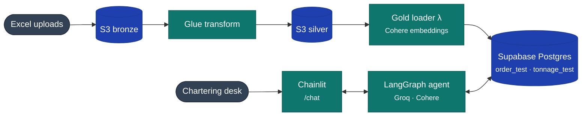
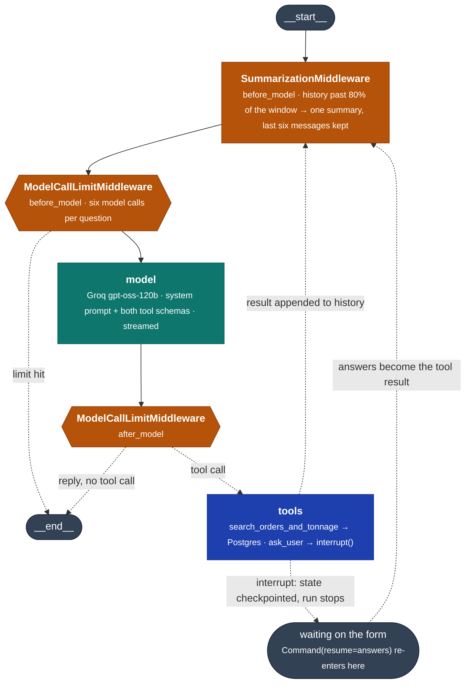

# Ocean-Intelligence-

Data pipeline for the SMU IS483 capstone with Cargill Ocean Transportation. An Excel file placed in the bronze S3 bucket is automatically transformed into cleaned JSON in the silver bucket, then embedded and loaded into Supabase gold tables, where it becomes available to the dashboard and chatbot.

This repository covers the bronze-to-silver-to-gold data layers and the chat agent that queries the gold tables. The RAG components are maintained elsewhere.

Status: deployed and verified end to end.

## 1. What it does

Two flows that share exactly one thing — the gold tables in Supabase — and are otherwise
independent. A nightly pipeline turns broker spreadsheets into embedded rows; a chat agent
answers questions against those rows in real time.



The pipeline runs on a schedule and on upload; the agent runs per question. Neither knows the
other exists. Sections 2 and 5 to 8 take each half in turn.

## 2. Data pipeline

```
Excel upload → EventBridge → SQS → Lambda → Glue → JSON in silver
                (filters)  (queues)  (selects)  (transforms)

Glue SUCCEEDED → EventBridge → Lambda → Cohere embeddings → Supabase gold
                                (reads)   (embeds new/changed) (upserts)
```

### 2.1 Bronze → Silver

An `.xlsx` file placed in `bronze-ocean-layer` triggers an S3 notification. EventBridge filters for the `.xlsx` suffix and forwards the event to an SQS queue. A Lambda function consumes the queue, waiting up to 60 seconds so that a multi-file upload produces a single invocation.

The Lambda determines what work is outstanding by listing every `.xlsx` object in the bucket and checking each against a DynamoDB ledger of processed files. It passes the remainder to Glue, which transforms them and writes `orders/orders.json` and `tonnage/tonnage.json` to `silver-ocean-layer`, then records the processed files in DynamoDB.

The Lambda discards the queue message contents and re-derives its file list from the bucket on every invocation, making the bucket the single source of truth. Lost, duplicated, or out-of-order messages cannot affect correctness. A scheduled rule invokes the same function daily at 06:00 SGT as a fallback.

Files are tracked by S3 path combined with object ETag, so replacing a file at an existing path is correctly treated as new work.

### 2.2 Silver → Gold

When the Glue job's state changes to `SUCCEEDED`, AWS emits this automatically to the account's default EventBridge bus — no manual notification setup is needed here, unlike the bronze bucket. A rule matching that job name and state invokes the gold loader Lambda.

The event payload is ignored. Since every Glue run republishes the full silver dataset rather than a delta (a read-modify-write on a single JSON object), the gold loader always re-reads `orders/orders.json` and `tonnage/tonnage.json` in full from `silver-ocean-layer`.

Before doing any real work, it checks a DynamoDB record of each file's content hash from the last successful run. If both `orders.json` and `tonnage.json` are byte-identical to what was already loaded, the run exits immediately — no Supabase connection, no embedding calls.

If the files have changed, it estimates the resulting Supabase payload size (row count × columns, including embedding vectors at the configured dimension) and skips the run if the combined estimate exceeds 495 MB, again without touching Supabase or Cohere.

Otherwise, it fetches each row's previously stored `embedding_source_hash` from `order_test` / `tonnage_test` and only calls the Cohere embeddings API for rows whose hash has changed — unchanged rows reuse their existing stored embedding. All rows (not just the re-embedded ones) are then upserted, since non-embedded columns can change independently of embedded ones. On success, the new content hashes are recorded for the next run's short-circuit check.

`order_test` embeds six free-text fields (`cargo_type`, `discharge_port`, `cargo_description`, `load_port`, `discharge_parent_zone`, `load_zone`); `tonnage_test` embeds four (`vessel_status`, `destination`, `parent_zone`, `open_area`). Each is stored as a separate `vector(512)` column (Cohere `embed-v4.0`, truncated via `output_dimension`) — plain `vector`, not `halfvec`, since 512 is well under pgvector's 2,000-dimension index ceiling. No ANN index (HNSW/IVFFlat) is created on either table yet; nothing in the repo does similarity search over the gold tables today, so an index across ten vector columns would only add to on-disk size for no current benefit.

### 2.3 Full pipeline: bronze to gold


Teal is a Lambda doing real work, blue is a data read/write, amber is a routing or dedup decision, grey is a terminal outcome. Both dashed "skipped" exits on the gold loader side (content-hash match, oversized payload) return before a Supabase connection is opened.

| Layer | What gets skipped/reused | Mechanism |
|---|---|---|
| Bronze → Silver | Already-processed `.xlsx` files | `ProcessedFilesTable`, keyed on S3 key + ETag |
| Silver → Gold, file level | Entire Lambda run if silver files are byte-identical to the last successful load | `GoldProcessedHashTable`, keyed on content hash |
| Silver → Gold, row level | Cohere calls for rows whose embedded fields didn't change | `embedding_source_hash` comparison against Supabase |
| Silver → Gold, size guard | Runs that would produce an oversized Supabase payload | `MAX_UPLOAD_BYTES` (495 MB) pre-flight estimate |

## 3. Data caveats

**Vessel-to-order links are synthetic.** The tonnage source contains no Order ID column, and no relationship between vessels and orders exists in the source data. `assign_order_ids` generates this relationship artificially, assigning each vessel an `order_id` from the orders pool solely to permit the two tables to be joined. These are not real Cargill fixtures, and any feature presenting them as genuine vessel matches is displaying fabricated data.

**Two required columns contain no data.** `assigned` and `assigned_vessel_name` are 100% null; `commercial_status` is 79.2% null. These are deficiencies in the source workbooks rather than pipeline defects, and both affect core deliverables — vessel-order matching and US-2.2 respectively.

**Date coverage differs.** Tonnage extends to 2026-04-21, orders only to 2026-01-06. Time-based joins will produce a three-month period containing vessels but no orders.

## 4. Gold schema

What survived the pipeline, mapped to `SMU_2025_Data_Glossary`. Seventeen real columns per
table out of roughly 60 order and 110 tonnage fields in the glossary, plus two pipeline
columns and one `vector(512)` per embedded text field. The agent reads only the
`cargo_description` vector; zones, statuses, cargo types and ports are matched lexically
per comma-separated element, against names the prompt lists from
`backend/vocabulary.json` (regenerate with `python -m ai_platform.backend.vocabulary`).

Glossary names differ from column names where the source header was awkward; the bold ones
are worth knowing when reading the glossary alongside the database.

The Agent column reads: **filter** for an exact SQL comparison, **semantic** for a vector
match, **display** for shown in the results table but not searchable, and **unused** for
columns the agent never selects at all.

### 4.1 `public.order_test` — cargo enquiries

One row per enquiry. 1,864 rows, 1,864 distinct `order_id`.

| Column | Glossary name | Definition | Agent |
|---|---|---|---|
| `order_id` | Order ID | Unique identifier for this order row | filter |
| `date_received` | Date Received | When this version of the report was received | filter |
| `update_date` | Update Date | When the record was last refreshed or amended | filter |
| `laycan_start` | Lay-Can Start | Earliest date the vessel must be ready to load | filter |
| `laycan_end` | Lay-Can End | Cancelling date — after this the charterer may walk | filter |
| `load_port` | **Load / Deli** | Load port, or delivery point on a time charter | semantic |
| `discharge_port` | **Disc / Redel** | Discharge port, or redelivery range | semantic |
| `load_zone` | **Load Parent Zone** | Trading region containing the load port | semantic |
| `discharge_parent_zone` | Disc Parent Zone | Trading region containing the discharge port | semantic |
| `cargo_type` | **Cargo Types** | Standardised commodity, e.g. IRON ORE, COAL | semantic |
| `cargo_description` | **Cargo Desc.** | Free-text description of the cargo | semantic |
| `cargo_weight_min` | Cargo Weight Min | Minimum cargo quantity offered, metric tons | filter |
| `cargo_weight_max` | Cargo Weight Max | Maximum cargo quantity offered, metric tons | filter |
| `assigned` | Assigned (T/F) | Whether assigned to a vessel | unused, 100% null |
| `assigned_vessel_name` | Assigned Vessel Name | Vessel assigned to this order | unused, 100% null |
| `embedding_source_hash` | — | Pipeline: detects when text changed and needs re-embedding | unused |
| `gold_loaded_at` | — | Pipeline: when the row was written | unused |

### 4.2 `public.tonnage_test` — vessel positions

One row per reported position, **not** per vessel. 11,105 rows over 1,037 vessels. The agent
reads only the newest report per vessel, and only reports stamped on or before the working
date, so an unfiltered search returns 1,010 vessels. `include_history` and `include_future`
lift each rule.

| Column | Glossary name | Definition | Agent |
|---|---|---|---|
| `tonnage_row_key` | — | Pipeline-generated row key, not in the glossary | unused |
| `vessel_id` | **Vessel Name** | Anonymised ship identifier, e.g. "VESSEL 0663" | filter |
| `update_date` | Update Date | When the record was last refreshed or amended | filter |
| `first_date_received` | First Date Received | When this position was first reported, before revisions | filter |
| `dwt` | **DWT Summer** | Deadweight at the summer load line — cargo + fuel + stores | filter |
| `ship_type` | **Ship Types** | Vessel type, e.g. Bulk Carrier | display, 99.8% one value |
| `ship_size` | **Ship Sizes** | Size segment, e.g. Capesize | display, all Capesize |
| `vessel_status` | **Status** | AIS navigational status, e.g. Anchored | semantic |
| `ballast_laden` | **Ballast/Laden** | Sailing empty or with cargo | filter |
| `commercial_status` | Commercial Status | Fixture status — FIXED, ON SUBS, or unfixed | filter, 79% null |
| `open_area` | **Open Areas** | Area or port where the vessel comes open | semantic |
| `parent_zone` | Parent Zone | Trading region containing the open area | semantic |
| `open_date_start` | **Open Dates Start** | Earliest date the vessel is expected to be free | filter |
| `open_date_end` | **Open Dates End** | Last day of the open window | filter |
| `destination` | Destination | Port currently reported via AIS as its destination | display, dropped |
| `eta` | **ETA** | Estimated arrival at the AIS-reported destination | display, dropped |
| `order_id` | Order ID | Order this vessel is assigned to — **synthetic**, see Data caveats | display |
| `embedding_source_hash` | — | Pipeline: detects when text changed | unused |
| `gold_loaded_at` | — | Pipeline: when the row was written | unused |

### 4.3 Notes on what changed

**`eta` is the AIS field, not the window.** The glossary carries `ETA Dates Start`, `ETA Dates
End` and `ETA On Time`; none reached gold. What survived is the separate `ETA`, an estimate of
arrival at a destination the crew typed into the transponder. It and `destination` were dropped
from the agent for that reason — both stay visible in the results table, and
`destination_embedding` is still written by the loader but read by nothing.

**The two tables kept different received-dates.** Orders kept `Date Received`, the timestamp of
this revision. Tonnage kept `First Date Received`, the timestamp of the original report. Neither
kept both, so revision lag cannot be computed on either.

**Every timestamp is `timestamp without time zone`.** No offset is stored anywhere.

## 5. Entry point and process model

One process. FastAPI owns the server and Chainlit is mounted inside it, so there is no second
service to start and no proxy between them.

```
uvicorn ai_platform.app.main:app
```

| Route | Served by | Purpose |
|---|---|---|
| `/` | `read_dashboard()` in `app/main.py` | the dashboard page |
| `/health` | `read_health()` in `app/main.py` | liveness |
| `/api/stats` | `read_stats()` in `app/api/dashboard.py` | row counts for the current schema |
| `/static/*` | `StaticFiles` | dashboard assets |
| `/chat` | `mount_chainlit` → `app/cl_app.py` | the chat interface |

**Three ordering constraints in `app/main.py`, all load-bearing.** Routes must be registered
before `mount_chainlit`; anything declared after it returns 404. `root_path` must stay unset or
mounting fails outright. And the dashboard is an explicit route rather than `StaticFiles`
mounted at `/`, because a mount at `/` matches every path, shadows `/chat`, and Chainlit never
sees the request.

**The agent never imports chainlit.** `ai_platform/backend/` reaches the UI only through
LangGraph's custom stream writer, which is what lets the graph run headless — in tests, in an
eval harness, or from a script.

## 6. Data source connector

Every outbound call the running app makes, by function.

| Service | Function | Module | Target |
|---|---|---|---|
| Postgres — fleet data | `get_dsn()`, `fetch_rows(sql, params)` | `backend/db.py` | session pooler, `public` schema |
| Postgres — chat history | `get_schema_name()`, `get_data_layer()` | `app/data_layer.py` | same database, `dev` schema |
| Postgres — dashboard | `get_engine_url()`, `read_stats()` | `app/api/dashboard.py` | same database, `dev` schema |
| Groq — chat and extraction | `get_client()`, `get_model_name()`, `stream_chat()` | `backend/llm.py` | `api.groq.com/openai/v1`, `openai/gpt-oss-120b` |
| Cohere — query embeddings | `embed_search_terms()` | `backend/embeddings.py` | `api.cohere.com/v2/embed`, `embed-v4.0` at 512 |
| Supabase storage | `get_storage_client()` | `app/data_layer.py` | S3 protocol, bucket `chainlit-dev`, private |

**Two independent paths to the same database.** The agent reads fleet data from `public`
through asyncpg. Chainlit writes threads, steps and elements to the environment schema through
SQLAlchemy. Neither knows about the other, and they use different drivers.

`get_dsn()` strips the `+asyncpg` marker from `CHAINLIT_DATABASE_URL` — SQLAlchemy needs it,
asyncpg rejects it. `fetch_rows` opens a connection per call with a 30-second timeout and is
read-only by construction: every value is a bound parameter and every column name comes from
the package, never from the model.

**The session pooler caps at 15 concurrent connections.** Exceeding it surfaces as
`EMAXCONNSESSION`, counting Chainlit's SQLAlchemy pool and every `fetch_rows` call together.
`db.py`'s own docstring notes the connection pool that belongs there once query rate justifies
one.

**Two failure modes that are silent rather than loud.** `embed_search_terms` must send
`input_type="search_query"` against the `search_document` the gold loader wrote with; a
mismatch returns confident nonsense and raises nothing. And the storage client must presign
with SigV4 explicitly — botocore defaults to SigV2 against this endpoint, which makes uploads
succeed while every read returns 403.

## 7. The chat agent

A LangChain `create_agent` loop over the gold tables `public.order_test` and
`public.tonnage_test`, served by Chainlit at `/chat`. One model, two tools, three
middleware. There is no fixed sequence of steps: the model reads the question, decides
whether to search or ask, reads what came back, and decides again. `backend/agent.py`
compiles it; the graph below is what `agent.get_graph()` reports.



Teal is the model call, blue is tool execution, amber is middleware. Dotted edges are
conditional. The loop is `summarise → limit → model → limit → tools → summarise` until the
model replies without calling a tool, or the call limit ends it.

| Node | What it does | Calls |
|---|---|---|
| `SummarizationMiddleware.before_model` | When history passes 80% of the 131k window, condenses everything but the last six messages into one summary | Groq, only when it fires |
| `ModelCallLimitMiddleware.before_model` / `after_model` | Counts model calls; ends the run at six so a loop cannot run away | — |
| `model` | The LLM turn. Gets the system prompt from `agent_system.md`, both tool schemas, the conversation; returns a reply or a tool call | Groq `openai/gpt-oss-120b` |
| `tools` | Runs the tool the model chose | Postgres via `fetch_rows`; Cohere only when `cargo_description` was set; `interrupt()` for `ask_user` |

`ToolErrorMiddleware` is not a node — it wraps the tool call and turns a failure into a
message the model can act on, so a timeout becomes "narrow the search" rather than a crash.

**Two tools.** `search_orders_and_tonnage` takes a flat `cargoes` model and a flat `vessels`
model, runs whichever were set concurrently, and returns both row lists plus `capped` — the
tables whose `cargo_description` search hit the fifty-row limit. Names (zones, statuses,
cargo types, ports) are matched per comma-separated element in SQL; only `cargo_description`
is embedded. `ask_user` takes one to four questions with two to four options each and calls
`interrupt()`; the answers come back as the tool's return value when the run resumes.

**Two model calls for a search, three or more when it asks.** Question → tool call → result →
reply is two. A form adds a resume: the model reads the answers, searches, then replies.

**The checkpointer is what makes `ask_user` possible.** `interrupt()` saves the graph's state
under the thread id and stops; `cl_app.run_agent` shows the form, then calls the agent again
with `Command(resume=answers)`, which reloads that state and continues from inside the tool
call. `InMemorySaver` holds it in the process — a restart loses every thread and every open
form. A Postgres checkpointer is the fix and is not installed yet.

**What the model never does** is write SQL. Tool arguments are validated by Pydantic
(`extra="forbid"`), column names come from `TableSpec`, values are bound parameters, and
`fetch_rows` is read-only by construction.

## Dashboard Status Overview

Served by the same FastAPI app as the chat, at `/` (`ai_platform/dashboard/index.html`), reading `public.tonnage_test` / `public.order_test` through `ai_platform/backend/dashboard_queries.py` and the views in `infra/sql/dashboard_gold_views.sql`.

**Before first use**, apply the views once: `psql "$SUPABASE_DB_URL" -f infra/sql/dashboard_gold_views.sql` (or paste into the Supabase SQL editor). Idempotent, like `gold_layer_test_setup.sql`, and not applied automatically by anything in this repo. (Applied and verified live as of this writing.)

**Data source is `tonnage_test`/`order_test`, not the plain `tonnage`/`order`.** This dashboard originally read `public.tonnage`/`public."order"`, but neither has a loader anywhere in this repository, and they turned out to be a stale, smaller snapshot with a real defect: `tonnage.order_id` (`numeric`) is precision-corrupted for effectively every row, confirmed live (e.g. stored as `1.52324E+17` instead of its full 18-digit value — a lossy float round-trip somewhere upstream). `tonnage_test`/`order_test` — the vector-embedded tables the deployed gold-loader Lambda (`scripts/gold_loader`) actually keeps current, per its `EventBridge -> GoldLoaderLambda` trigger on every Glue success — don't have that defect (`order_id` is clean `bigint` on both, confirmed live), are a strict superset of the old source (1,122 vessels vs. 1,037; 1,949 orders vs. 1,864), and their vessel↔order join actually resolves: 100% of `tonnage_test` rows join to `order_test` on `order_id`, tested directly, versus effectively 0% on the old source (consistent with `filterable_fields.md`'s note that the old `tonnage.order_id` "matches zero rows in orders" — it couldn't, the values no longer round-tripped).

Endpoints, all under `/api/dashboard/`:

| Endpoint | Backs |
|---|---|
| `GET vessels?status=&region=&sort=` | Vessel tracker, filterable by Fixed/Open/On Subs and region, sortable by ETA, last update, or open-window end. In the UI: searchable by vessel ID and paginated client-side (25/page) rather than rendering everything at once. |
| `GET vessels/status-counts` | Fleet-wide FIXED/OPEN/ON SUBS counts, independent of whatever filter the vessel table itself has applied — backs the tracker's summary tiles (clicking a tile also sets the table's status filter) |
| `GET regions` | Regional supply (open vessels) vs. demand (orders received in the last 90 days) — rendered in the UI as a bubble map (size = supply, color = a tight/balanced/oversupplied/no-data status), with a plain table view as the accessible fallback |
| `GET changes?window=dod\|wow` | New vessels, vessel status transitions, field-level changes (open area/DWT/destination/ETA/region/ballast-laden, per vessel report vs. its immediately preceding one), vessels that stopped reporting recently (labelled "Removed" in the UI, struck through), new orders, amended orders — each category grouped by calendar day in the UI |
| `GET ecsa?sort=` | Vessels currently ballasting (empty, repositioning — `ballast_laden = 'BALLAST'`) toward East Coast South America, strict single-region match on `parent_zone`. Gated behind a "Show all vessels" toggle in the UI rather than rendering on load, and searchable by vessel ID (typing a match reveals the table automatically). |
| `GET ecsa/{vessel_id}/history` | That vessel's status trail (e.g. On Subs → Open → Fixed), derived from `tonnage_test`'s own row history — no separate events table |

The whole dashboard auto-refreshes hourly (matching the product spec's stated real-world preference over a daily cadence — brokers send updates throughout the day), plus a manual "Refresh now" button, both restoring the last-refreshed timestamp shown at the top of the page. A failed background refresh never wipes what's already on screen — every load function takes an `isRefresh` flag that, when true, throws on failure instead of overwriting good content, and `refreshAll()` in `ai_platform/dashboard/index.html` turns any failures into a visible "data may be stale" banner naming which section(s) failed and how old the data being shown is, rather than either failing silently or blanking the page. Fixed one related pre-existing bug while building this: `loadRegions()` used to cache its first successful fetch and never re-fetch on any subsequent call — auto-refresh would have silently kept showing the initial snapshot for the regional map/table forever.

Every `order_id` is cast to text end to end, in SQL and in the query builder alike: `scripts/glue_transform.py`'s `with_stable_order_id()` caps generated order IDs at 18 digits so they fit Postgres `int8`, but 18 digits still exceeds JavaScript's safe integer range, so a raw numeric `order_id` would silently corrupt in any browser's `JSON.parse`.

**Built against a real product spec (5 user stories with acceptance criteria)**, which resolved one placeholder and surfaced two real bugs directly:
- The demand window's `[CONFIRM WITH SPONSOR]` placeholder is now confirmed as 90 days, not the earlier 7-day guess ("Date Received — windows demand to trailing 90 days").
- `ecsa_ballasters` had no `ballast_laden` filter at all before this — a laden vessel already carrying cargo toward ECSA was shown identically to an empty vessel repositioning there, even though the story is specifically about vessels *ballasting* toward ECSA. Fixed to require `ballast_laden = 'BALLAST'`.
- "Removed" records (`vessels_no_longer_fresh`) are now presented in the UI as struck-through "Removed" entries per the spec's explicit acceptance criterion, with a tooltip preserving the underlying caveat: this is still only an inferred "stopped reporting" signal, not a real deletion — nothing in this data model records a withdrawal.
- Two fields the spec names — "Last Known Cargoes" and "Build Year" — don't exist in `tonnage`/`tonnage_test` at all. The ECSA table's "Last cargo / destination" column was actually only ever showing `destination` (the vessel's next AIS-reported destination) mislabelled as last cargo; relabelled to just "Destination" rather than continuing to imply data that isn't there. No age/build-year filter was added, for the same reason — the data to filter on doesn't exist in this source.

**"Now" is simulated as real time minus one year** — an explicit design choice, not a bug fix. This dataset's real activity (tonnage to 2026-04-21, orders to 2025-12-30) sits months behind the database's true clock, so any date-relative logic keyed to real `now()` would read as permanently stale/empty. `tonnage_reference_now()` / `orders_reference_now()` in the SQL file compute "real now minus one year" instead; any row dated on or after that simulated instant is excluded outright everywhere a view or query reads the source tables directly, not merely treated as "not yet fresh."

**FIXED/OPEN/ON SUBS is a date-range containment check, not "whatever the latest report says."** A vessel is FIXED today only if *some* row (not necessarily its most recently updated one) has `commercial_status = 'FIXED'` and that row's own `[open_date_start, open_date_end]` window actually contains the simulated "today" — see `vessel_current_status`'s `active_bookings` CTE. A FIXED report whose window has already elapsed no longer makes the vessel FIXED, even if it's the newest thing on file for that vessel. `ON SUBS` gets the same window-containment treatment and reports under its own raw label — the dashboard used to relabel it WATCHLIST, but the raw data only ever contains `FIXED`/`ON SUBS`/`NULL` (confirmed live: 2,312 / 19 / 8,859 rows), so the invented label was dropped in favor of the terminology actually used in the source data. Under the current simulated date this makes FIXED/ON SUBS rare — 3 FIXED, 0 ON SUBS out of 1,009 vessels, verified live — because this dataset's fixture windows are mostly short and rarely happen to land on the one simulated date.

**One mapping still needs sponsor sign-off**, marked `[CONFIRM WITH SPONSOR]` in the SQL file: the staleness threshold (48h placeholder). Whether `ON SUBS` should occupy a vessel for date-range-containment purposes the same way `FIXED` does is also still unconfirmed policy, though the display label itself is now settled — it stays `ON SUBS`, matching the raw data.

**Known gaps.** `order_test` still has no commercial-status column (`scripts/glue_transform.py`'s `transform_orders` never selects one), so the orders side of the change feed can only report new/amended orders, not status changes. Staleness (`is_stale`/`open_window_lapsed`) is still computed from a vessel's single latest-updated row, not the same "search every row for one covering today" logic `dashboard_status` now uses — the two signals can legitimately disagree about which row matters, and that hasn't been reconciled.

**The plain `public."order"` table is still named `order` (singular, not `orders`), and still has the same pre-existing bug.** `ai_platform/backend/tables/orders.py`'s `TABLE = "orders"` constant still doesn't match it — a bug in the chat agent's orders path, independent of and untouched by this feature (which no longer reads that table at all, having moved to `order_test`).

**A note on how this was built:** this feature went through several iterations of live verification and correction — initial schema assumptions came from static analysis (`filterable_fields.md`, `ai_platform/backend/tables/{orders,tonnage}.py`) because the sandbox couldn't reach the database at first (`SUPABASE_DB_URL` failed to resolve; `.env`'s `CHAINLIT_DATABASE_URL` pointed at a stale, different Supabase project). Once that was corrected, live introspection surfaced — in order — the `orders`/`order` table-name bug, the `tonnage.order_id` corruption, the frozen-dataset/wall-clock staleness problem, an ECSA filter that was too permissive, a genuine gap in the FIXED-status logic (using the latest row instead of date-range containment), and finally that `tonnage`/`order` themselves were the wrong source entirely. `.env` is gitignored, so those credential fixes are local-only and never touched git history.

## Full pipeline: bronze to gold
## 8. The UI layer

Chainlit 2.11.1. Everything the browser loads lives under `ai_platform/public`, configured by
`ai_platform/.chainlit/config.toml`.

```mermaid
flowchart TB
    subgraph browser["Browser"]
        composer["Composer<br/><small>the user types here</small>"]:::ui
        reply["Reply<br/><small>streamed token by token</small>"]:::ui
        steps["Progress steps<br/><small>one per node</small>"]:::ui
        panel["Results.jsx<br/><small>side panel, filters + selection</small>"]:::jsx
        bar["ComposerBar.jsx<br/><small>examples + context fill %</small>"]:::jsx
    end

    subgraph server["cl_app.py"]
        run["run_agent()"]:::py
        drain["drain_until()<br/><small>pulls the stream in segments</small>"]:::py
        props["results_props()"]:::py
        refresh["refresh_gauge()"]:::py
    end

    graph["LangGraph agent"]:::agent

    composer --> run --> graph
    graph -. "custom stream<br/>{answer: token}" .-> drain --> reply
    graph -. "updates<br/>one per node" .-> drain
    drain --> steps
    drain --> props --> panel
    run --> refresh --> gauge
    panel -. "selected rows as markdown" .-> composer

    classDef ui fill:#334155,stroke:#1e293b,color:#fff
    classDef jsx fill:#b45309,stroke:#92400e,color:#fff
    classDef py fill:#0f766e,stroke:#0b5d56,color:#fff
    classDef agent fill:#1e40af,stroke:#1a3a94,color:#fff
```

Amber is a custom React element, teal is Python in `cl_app.py`, blue is the graph. The dotted
edge from the panel back to the composer is the send-to-chat button: it writes, it does not
send.

**Two custom React elements**, rendered by Chainlit's react-live runtime:

`Results.jsx` is the results panel — the table beside each reply. Per-column filter dropdowns
with a search box inside each, row selection, windowed pagination, and a button that writes the
selected rows into the chat composer as a markdown table. It writes rather than sends, so the
user presses enter themselves. Props come from `results_props()` in `cl_app.py` as `columns`,
`rows` and `noun`.

`ComposerBar.jsx` pins above the composer: starter prompts on the left, context gauge on the
right. Chainlit renders its own starters only on the empty welcome screen, so from the first
reply onward the *examples* menu is what keeps them reachable — picking one writes the text
into the composer and leaves the user to press enter. The gauge reads 0 on a new conversation
because `_SEED_OVERHEAD` — the system prompt plus every tool as it goes on the wire, counted
with tiktoken at import — is deducted from the window up front. Props are
`percent`, `used`, `usable`, `spent` and `starters`. It is sent unpersisted and re-anchored on
resume.

**Progress steps** wrap segments of the graph's event stream rather than the whole run, which
is why `cl_app.py` pulls the stream by hand through `drain_until` instead of one `async for`.
*Compacting conversation*, *Reading your question*, *Embedding search terms* and *Retrieving
data* each map to one node reporting.

**The results panel's name is appended to the reply text, and that line is load-bearing.**
Chainlit builds a regex from the names of a message's elements and turns every match in the
message body into the link that opens the side panel. Without an occurrence of the name there
is no link, so once a user closes the panel it cannot be reopened.

**One config trap worth knowing.** `custom_css` takes no `/chat` prefix — it is
`/public/theme.css` — while `login_page_image` and `header_links` do. Get it backwards and
Chainlit serves the SPA's HTML as `text/css` with a 200, so the theme silently never applies
and nothing in the console says why.

## 9. Current capabilities and limits

**Any number of files per run.** Every unprocessed file is passed to a single Glue run. No cap exists at any point in the bronze-to-silver pipeline.

**One Glue run at a time.** Files uploaded during a run are not processed immediately. The Lambda detects the running job, raises, and the SQS message is retried after 420 seconds until Glue is available. After 10 retries, approximately 70 minutes, the message moves to the dead-letter queue. Glue's job timeout is 60 minutes, leaving a narrow margin under sustained load.

**Near-real-time for single uploads.** Worst-case latency from upload to Glue start is roughly 60 seconds, plus Glue's cluster provisioning time of about a further 60 seconds.

**Output volume.** `orders.json` holds 1864 records across 15 fields; `tonnage.json` holds 11105 records across 16 fields, covering 1037 unique vessels.

**Gold loader upload cap.** A single silver-to-gold run is skipped if the estimated combined upload (rows plus embedding vectors, at the configured Cohere dimension) exceeds 495 MB. This is a pre-flight check based on row count and dimension, not the size of the silver JSON files themselves.

**Gold loader embedding cost.** Only rows whose embeddable fields changed since the last successful load are sent to Cohere. A Glue run that only touches one of the two datasets, or republishes without content changes, results in zero embedding calls on the next gold load, caught by the file-level content-hash check before any row-level comparison happens.

## 10. Deployment

```
scripts/glue_transform.py            ← transformation logic (bronze → silver)
scripts/gold_loader/                 ← handler, db, embeddings, silver_reader (silver → gold)
infra/smu_daily_pipeline.yaml        ← Lambda, queues, Glue job, DynamoDB table (bronze → silver)
infra/smu_gold_loader.yaml           ← Lambda, EventBridge rule, IAM role, hash table (silver → gold)
infra/sql/gold_layer_test_setup.sql  ← order_test / tonnage_test schema (run once manually)
```

Changes to the bronze-to-silver transformation logic require only re-uploading `glue_transform.py` to `s3://bronze-ocean-layer/scripts/`. Infrastructure changes require deploying the relevant CloudFormation stack with `CAPABILITY_NAMED_IAM`.

`smu_daily_pipeline.yaml` needs `BronzeBucketName`, `SilverBucketName`, and `GlueScriptS3Uri`. `smu_gold_loader.yaml` needs `SupabaseDbUrl` and `CohereApiKey` (both `NoEcho`), plus a packaged Lambda zip built per the template's build-step comment and uploaded to `CodeS3Bucket`/`CodeS3Key`. Deploy `smu_gold_loader.yaml` after `smu_daily_pipeline.yaml` — its `GlueJobName` parameter must match the Glue job created by the daily pipeline stack.

Before the first invocation, `infra/sql/gold_layer_test_setup.sql` must be run once manually against the target database (`psql "$SUPABASE_DB_URL" -f infra/sql/gold_layer_test_setup.sql`, or pasted into the Supabase SQL editor) — it is idempotent and safe to re-run, but is not applied automatically by the Lambda or the CloudFormation stack. It creates the `vector` extension plus `order_test` and `tonnage_test`, with `vector(512)` columns matching the default `EmbeddingDimension` parameter; changing that parameter away from 512 requires updating this SQL file's column definitions to match.

EventBridge notifications must be enabled manually on the bronze bucket via S3 → Properties → Event notifications → Amazon EventBridge → Edit → On. CloudFormation cannot apply this because the stack does not own the bucket. If the bucket is recreated the setting must be reapplied, or uploads will generate no events and the pipeline will run only on its daily schedule. The Glue-success trigger for the gold loader needs no equivalent manual step — Glue job state changes are published to the default EventBridge bus automatically.

If files cease to be processed at the bronze-to-silver stage, examine the dead-letter queue `smu-daily-trigger-uploads-dlq` first. If silver data stops reaching Supabase, check the `GoldLoaderLambda`'s CloudWatch logs for a `"skipped"` summary — it may be a legitimate no-op (unchanged content, or an oversized estimated payload) rather than a failure.

Account `FYP_oceanAI` (334298574595), region `us-east-1`, stack `smu-daily-pipeline`.

| Resource | Name |
|---|---|
| DynamoDB (bronze→silver) | `smu-processed-files` |
| DynamoDB (silver→gold) | `smu-gold-loader-processed-hashes` |
| Glue job | `smu-glue-transform` |
| Lambda (bronze→silver) | `smu-daily-trigger` |
| Lambda (silver→gold) | `smu-gold-loader` |
| SQS / DLQ | `smu-daily-trigger-uploads`, `-dlq` |
| EventBridge (bronze→silver) | `smu-daily-trigger-on-upload`, `-schedule` |
| EventBridge (silver→gold) | `smu-gold-loader-on-glue-success` |
| Supabase tables | `order_test`, `tonnage_test` |

The principal scaling constraint is that each silver table is a single JSON object, requiring read-modify-write on every update, which is what necessitates one concurrent Glue run. Migrating silver to RDS PostgreSQL, already in the project proposal, removes this constraint.