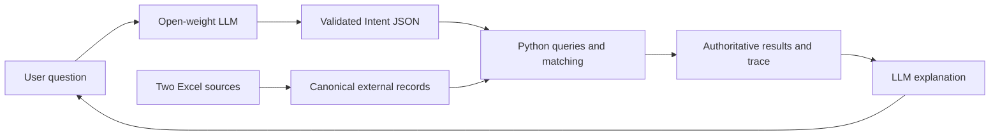

# Freight AI POC

Wide result tables use a wider, borderless chat layout with horizontal overflow
contained inside the message. Historical DWT queries preserve both quantity and
history constraints; the reference snapshot returns 4,708 historical reports at
180,000 tonnes or above, rather than the 470 latest-only reports.

Record lists are rendered as source-backed Markdown tables in chat, including
record IDs, relevant quantities/dates and provenance. General record-search
requests cannot be routed to unrestricted general-knowledge prose. Explicit
laycan-start ranges and cargo similarity requests have validated query paths.
The 12 September read-only smoke returned 102 orders starting laycan on
1–15 January 2025 and ten locally ranked cargo suggestions for steelmaking raw
materials (as of 1 September 2026). Suggestions are not fixture evidence.

Business chat defaults: few-shot prompting, local conversation summarisation,
accent-insensitive word matching, and live read-only filtering for Supabase.
Semantic suggestions are selected for explicit “similar”, “related”, or “semantic”
requests when the local embedding model exists; ordinary lookups retain hard
filters. Capacity assumptions must be supplied by the user in chat.
Technical experiment controls are hidden unless `FREIGHT_POC_DEVELOPER=1` is set.
Model, source, reference date and refresh remain available in normal Settings.

A local, modular experiment for open-weight freight-language interpretation,
structured data queries, provisional vessel screening and QLoRA supervised fine-tuning.
The existing Ocean Intelligence application is unchanged. This package has its own
environment and dependencies; it does not use the existing database, embeddings,
cloud credentials, synthetic order links or RAG infrastructure.

## Start the demo

From the main Ocean Intelligence landing page, click **Open Freight AI**. Its
`/freight-ai` route starts this local demo on demand using the environment below.
You can also run it independently with the commands here. Non-local deployments
configure `FREIGHT_AI_URL` in the main application.

The primary interface is now **Shipping chatbot**. Ask questions such as “What is
laycan?”, “Which cargo orders load at Tubarao?” or “Screen vessels for the iron ore
order.” The chatbot routes general shipping education to detailed English model
answers and routes actual-record questions through the same validated intent,
deterministic query and matching engine used by the earlier prototype. Follow-up
questions retain the last conversation turns and previous data request. The original
filter/search and technical evaluation views remain available in secondary tabs.

From this directory, using Python 3.11+:

```bash
uv venv .venv
uv pip install --python .venv/bin/python -e '.[dev,ui]'
source .venv/bin/activate
freight-ai inspect
freight-ai preprocess
freight-ai dataset
freight-ai smoke
streamlit run app/streamlit_app.py --server.address 127.0.0.1
```

The Source data, Freight screening and Search with filters modes work without model
weights. Select an order and click **Screen vessels**. The explicit default as-of
date is **2026-09-01**, useful for the supplied sample windows. Rerun screening
after changing settings; saved results display their original date and assumptions.

The current workspace already has this isolated environment and processed data.
Business users can use **Search and questions → Search with filters → Run search**
to find cargoes or vessels without entering code. Results use readable tables,
dates, tonne units and plain-English screening reasons. **Ask AI** accepts a written
question and shows the interpreted request in English. JSON, internal identifiers
and raw traces are kept in collapsed technical sections; **Advanced JSON** remains
available for engineering experiments. Evaluation percentages have business labels.
The `.env.example` documents optional Hugging Face environment variables; this POC
does not auto-load `.env`. Export variables explicitly if needed.

## Data findings

Only these two files are authoritative freight inputs. Paths in
`configs/default.yaml` resolve relative to this project, independently of the shell's cwd.

| Source | Worksheet | Records | Columns |
|---|---|---:|---:|
| `../test_data/SMU_Order_data_TEST.xlsx` | Order Results | 3 | 12 |
| `../test_data/SMU_Tonnage_data_TEST.xlsx` | Tonnage Results | 3 | 16 |

`freight-ai inspect` reports every actual header, canonical mapping, null count,
observed type and source SHA-256. `preprocess` writes canonical JSONL and a rejection
report under `data/processed/`. The mapping is explicit in `data/ingest.py`.

There is no source order ID, assigned vessel, vessel–order relationship, usable cargo
capacity, port coordinates or route distance. Generated IDs identify content snapshots,
not stable business entities. Missing values remain null. The Port Hedland order
has no cargo type, description or weights. BRAVO has unknown commercial status.
`ETA Dates Start` refers to the next reported destination and is not arrival at the
order's load port. The workspace glossary supports the metric-tonne definitions;
it does not establish matching rules.

The six supplied TEST records stay out of training and prompt demonstrations. They
are used for deterministic acceptance tests and a separate tool evaluation only.
The larger workbooks under `../raw_data/` are intentionally not consumed.

## Architecture and boundaries



The LLM selects a supported action, dataset and constraints. It never executes SQL
or Python. Unknown fields, malformed JSON and unsupported constraints fail closed.
Model output is never repaired into a broader query. A natural-language requirement
that the model omits can still be wrong: inspect the extracted intent, and measure
exact intent accuracy. Schema validation alone cannot establish semantic correctness.

Python reads current records, filters, calculates, aggregates and ranks. Source and
processed-file hashes must match the preprocessing manifest before live queries run.
Timestamp filtering excludes future reports; tonnage uses the newest snapshot per
vessel name with conflict flags. Orders remain snapshots because stable business
identities cannot be established. Text matching is normalized exact equality, not
fuzzy search. Date and weight intervals use inclusive overlap; missing constrained
values do not pass. Sums report known totals and missing counts across the complete
filtered set before the display limit.

For explanations, the model selects record/candidate IDs or glossary keys from tool
evidence. Code validates those references and renders facts and units; invalid
selections fall back to a deterministic summary with a visible error. Free model
prose is not displayed as factual explanation: a real smoke test caught invented
units and events, preserved in the diagnostic narrative-risk-smoke report.
A small curated glossary supports DWT/laycan QA. Other conceptual questions
require expert review. Model training initially teaches intent behavior and routing;
it does not yet teach broad QA or explanation quality.

## Matching assumptions

These are configurable POC screening rules requiring domain-expert validation:

- Required cargo quantity defaults to the offered maximum. Choosing the minimum
  is an explicit experimental change, not a conclusion about charter terms.
- Cargo greater than total DWT is excluded. Usable cargo capacity stays unknown
  until a cargo fraction is explicitly supplied. No default fuel allowance is invented.
- `FIXED` and `ON SUBS` are provisionally blocked; `OPEN` is provisionally allowed.
  Missing or unrecognized status requires review. LADEN is retained for inspection;
  it is not automatically treated as permanently unavailable.
- Remaining laycan/open-window overlap is a screening requirement. It does not
  account for sailing time. Different open/load ports require arrival feasibility review.
- Geographic score is 1 for exact port equality, 0.5 for exact zone equality, 0 for
  a known zone difference, and unknown otherwise. Same-zone exclusion is optional.
- Capacity utilization, overlap fraction and geography receive weights 0.5/0.3/0.2.
  Scores are 100 times the weighted sum divided by total weight. Unknown components
  contribute zero; scores are neither probabilities nor commercially validated rankings.
- Optional coordinates require a source string. Haversine distance is in nautical
  miles and is straight-line distance, never a navigable sea route or ETA.

Candidates are `screened_candidate` or `needs_review`; exclusions have reasons.
Every result has `confirmed_match=false`. No draft, gear, commodity compatibility,
speed, port restriction, bunkers, economics or fixture validation is implied.

For the iron-ore order on 2026-09-01, ALPHA needs review; BRAVO and CHARLIE are
excluded. An assumed cargo fraction of 0.95 excludes ALPHA as well. This sensitivity
is visible in the trace and is covered by tests.

## Open-weight baseline and prompting

```bash
uv pip install --python .venv/bin/python -e '.[model]'
export HF_HOME="$PWD/artifacts/hf-cache"
freight-ai infer 'List orders loading at Tubarao.' --strategy few --as-of 2026-09-01
freight-ai query '{"action":"query","dataset":"orders","aggregation":"count"}' --as-of 2026-09-01
```

The default model is Qwen2.5-0.5B-Instruct pinned to the tested Hub commit. Change
model ID, revision, device, token budgets and adapter path in YAML. Models must
have a chat template; remote repository code is disabled. Generation is greedy
with a fixed seed. Context overflow fails rather than silently dropping constraints.
One-shot uses one training demonstration; few-shot uses three distinct training
families. All variants share the same schema and prompt files.

CPU and MPS support unquantized inference; this POC's 4-bit path requires CUDA.
The model is intentionally small for a local smoke test, not a quality recommendation.
Download/runtime needs vary with model size. Source records are not sent to a hosted API.

## SFT data and QLoRA

```bash
freight-ai dataset
# On a CUDA machine, with a compatible NVIDIA driver/PyTorch installation:
uv pip install --python .venv/bin/python -e '.[model,train]'
freight-ai train
```

`dataset` deterministically creates **66 train / 18 validation / 18 test** synthetic
intent examples, with split-specific phrasing families and fictitious ports/IDs.
It does not read spreadsheet rows. Headers informed the schema, not the training
entities. All three splits are independently specified; test examples never generate
training examples. Family IDs, normalized questions, labels, prompt/completion
consistency and hashes are checked before training. Demonstrations are train-only.
The manifest and generator version make the small corpus inspectable.

This is QLoRA **supervised fine-tuning**, using NF4/double quantization, PEFT LoRA and
TRL SFTTrainer. Only completion tokens contribute to loss. Overlong examples are
rejected before fitting. Validation runs each epoch; test data never enters Trainer
or checkpoint selection. The final adapter, tokenizer, model revision, settings,
data hashes, package versions and metrics are saved. Existing adapter output is
not overwritten. Select new checkpoint and adapter directories for each experiment.
The run does not publish to the Hub or send training telemetry.

Set `model.adapter_path` to the saved adapter for post-training inference. Its base
model/revision must match. The six-cell evaluator uses the same base precision,
decoding settings and held-out examples across base and adapter inference. Training
is 4-bit, while inference can be unquantized or 4-bit consistently for both variants.

**No QLoRA training run or trained adapter is delivered on this Apple Silicon host.**
The CUDA guard was exercised and TRL/PEFT imports were checked. GPU training,
adapter reload with trained weights and adapted-model evaluation remain unverified.
No full-parameter training path is implemented. There are too few real records and
no expert relevance labels to claim adaptation gains or commercial matching accuracy.

## Controlled evaluation

Freeze the prompt, split manifests, model revision and matching settings before
evaluating. Use validation for iteration and the test set only for final comparisons;
after inspecting test results, collect a new held-out set before further model selection.

```bash
freight-ai evaluate --base-only --output artifacts/evaluation/base-test-new.json
freight-ai evaluate --adapter artifacts/adapters/freight-qlora --output artifacts/evaluation/six-cell.json
freight-ai evaluate --base-only --tool-cases configs/tool_cases.json --output artifacts/evaluation/base-tools-new.json
```

The full matrix is base/QLoRA × zero/one/few-shot. Each run stores the same held-out
IDs, train demonstration IDs, raw generations, schema/JSON validity, exact intent
match, field accuracy, latency and errors. Output paths must be fresh. Missing
adapters raise an error; they are never replaced by base outputs.

Tool cases are manually labelled source acceptance fixtures held separate from SFT.
They check retrieval IDs, empty results, status filtering and ordered screening
candidates. Tool correctness requires both the expected intent and result. This
measures end-to-end correctness of LLM interpretation plus deterministic execution;
it is not a benchmark of human freight relevance or a model-only arithmetic comparison.
Use the default matching assumptions and fixed tool-case as-of date, 2026-09-01.

Raw JSON is strict: Markdown fences count as invalid. Exact match includes free-form
clarification wording; field accuracy includes easy defaults and must not be read
as domain understanding. These are tiny synthetic/acceptance benchmarks without
confidence intervals. Evidence-selection relevance and any future free-prose
explanation mode need expert review.

The model smoke report uses one validation example and is explicitly not a benchmark.
See `artifacts/evaluation/` for executed results and
[current chatbot tests](docs/current-chatbot-tests.md) for manual acceptance prompts.
The obsolete phase log and Excel-only prompt list were removed from active docs;
a recovery copy is in `artifacts/documentation-backups/obsolete-docs-2026-09-12.tar.gz`.

## Verification and layout

```bash
python -m pytest
ruff check .
ruff format . --check
freight-ai smoke
```

`src/freight_ai/data` owns ingestion and schemas; `inference` owns model loading and
prompts; `training` owns synthetic splits and SFT; `matching` owns queries and scoring;
`evaluation` owns paired metrics; `service.py` composes them; `app/` is a thin UI.
`data/raw/` documents external source locations without duplicating workbooks.
Generated model caches/checkpoints/adapters are ignored by Git. Preserve evaluation
reports and data manifests for experiments. Install editable from this project for
the bundled CLI default config and Streamlit app. A wheel supports explicit
`freight-ai --config /path/to/configs/default.yaml ...` with an external project layout.

API references used for the training implementation:
[TRL SFTTrainer 0.24](https://huggingface.co/docs/trl/v0.24.0/en/sft_trainer) and
[PEFT quantization](https://huggingface.co/docs/peft/developer_guides/quantization).
The tested macOS package snapshot is in `artifacts/environment-macos.txt`;
use the project dependency ranges on a CUDA host and record its resolved environment.

## Verification and larger-model iteration

See [iteration-2.md](docs/iteration-2.md) for verified acquisition, local-only
launching and reproducible comparison commands. Model loading now defaults to
local cache only. Download/verify model assets separately before first use.
The legacy 18 examples are regression cases; passing application tests does not
establish model quality. No QLoRA adapter has been trained.

### Switch models in the chatbot

In Shipping chatbot, use **Conversation model** to select Qwen 0.5B, 1.5B or 3B.
Each choice loads the matching local snapshot and pinned revision from its
verification report. CPU inference is used for consistency with the comparison.
Switching clears conversation context and the cached backend. The other experiment
tabs retain their own settings. Missing local snapshots disable chat with an
explanation. The first model-generated response includes model-loading time.

### Persistent screening assumptions

Percentage assumptions stated in Shipping chatbot remain active across follow-ups
and order changes within that conversation. Ask "What percentage are you using?"
or "Reset the capacity assumption" to inspect or clear it. Starting a new chat
or changing models clears this state. Invalid percentages do not replace the
previous valid value. Sidebar defaults apply when no conversation override exists.

### Prompt/schema experiment and expert review

Install the optional `experiment` extra for LM Format Enforcer 0.11.3. The paired
1.5B few-shot experiment is `scripts/schema_experiment.py`; it preserves the original
prompt and adds a versioned experiment prompt, comparing unrestricted generation
against token-level JSON-schema constraints. Semantic validation still applies.
See `data/evaluation/expert_review_queue.json` and
`docs/expert-evaluation-review.md`: these are candidate cases **pending external
freight-expert review**, not an expert-approved or blind benchmark.

### Supabase (read-only) data source

In Streamlit, select **Data source → Supabase (read-only)** in the sidebar.
The POC reads `public.order_test` and `public.tonnage_test`, the same tables as
 the main chatbot. Supabase is the Streamlit default. Excel remains selectable for reproducible historical evaluations. Set `FREIGHT_POC_SOURCE=excel` to start the UI in Excel mode.
Install the optional connector with `uv pip install -e '.[supabase]'` from this directory.
Credentials come from `POC_SUPABASE_DB_URL` (preferred) or the main project's
`CHAINLIT_DATABASE_URL`, in the environment or parent project `.env`. Never paste
credentials into chat. A SELECT-only database account can be supplied via the
preferred variable; the integration does not create roles or change permissions.

The connector uses TLS, a read-only connection default, and an explicit read-only,
repeatable-read transaction. Only fixed SELECT statements run; model-generated SQL
is never executed. No inserts, updates, deletes, migrations, or remote embeddings
are performed. Supabase retrieval requires network access; model inference remains
local. The in-memory snapshot is retained for the session. **Refresh Supabase snapshot**
reads again and clears the conversation and screening results. Switching sources also
clears those results, preventing Excel references carrying into Supabase conversations.

Mapping is based on the inspected database schema: `discharge_parent_zone` maps to
`discharge_zone`; `vessel_id` supplies the vessel label (an identifier, not a verified
ship name); `tonnage_row_key` identifies each report; `eta` maps to `eta_date_start`;
`first_date_received` supplies vessel report receipt time. Nulls remain unknown.
No synthetic `order_id` relationship or assignment field is interpreted as a confirmed
fixture. Geographic filters remain exact text comparisons; compound port/zone values
and spelling variants may not match. Existing as-of rules exclude records with missing
required timestamps. DWT allowances and matching remain provisional. The connector
fails rather than silently dropping invalid records or truncating beyond 100,000 rows
per table. Training and held-out Excel evaluation pipelines are unchanged.

Validation on 12 September 2026: loaded 1,864 orders and 11,102 vessel reports;
Streamlit source selection and a DWT-filter chatbot question completed without errors.
Counts reflect that snapshot, not a promise about future database contents.

Relative report-date searches: “show me orders from past week” (also “past 7 days”
or “last 7 days”, for orders or vessels) filters `update_date` across seven inclusive
calendar dates ending on the selected **As-of date**. The response explicitly states
this interpretation; it is not a laycan filter or a claim that reports were newly
created. Change As-of date to control the reference date. Empty results are valid
when the source contains no updates in that period.

During development, Streamlit fingerprints the complete POC Python package and
invalidates its imports together when source changes. This prevents new parsers
from using stale Pydantic schemas. Such code changes clear session state and cached
model resources; start a fresh conversation after an update.

### Expanded retrieval and local conversations

The query schema now distinguishes `received_from/to`, `updated_from/to`,
`start_from/to` and `end_to` (laycan/open endpoints), alongside interval overlap.
`include_history` preserves superseded vessel reports; `include_future` explicitly
removes the as-of horizon. Missing status remains unknown. Example chat requests:

- Show orders received in the past 7 days.
- Show orders updated in the past 30 days.
- Show history for VESSEL 0001.

These relative dates use the visible as-of date. More complex questions use the
LLM's schema extraction and require checking the displayed interpreted search.
In Experiment settings, **Flexible words and accents (local)** enables whole-word,
accent-insensitive containment (e.g. Tubarao matches Tubarão, Brazil). Exact mode
remains the default. This is lexical matching, not vector semantic retrieval;
country/region membership and synonym inference are not implemented.

**Saved conversations — stored locally** saves and restores replies and typed
capacity/intent state in `artifacts/conversations.sqlite3` with owner-only file
permissions. Restore requires the same source, model and as-of date. Replies are
historical; subsequent retrieval uses the current snapshot. Older user requests
are retained as bounded verbatim context alongside recent exchanges; this is not
LLM summarisation or unlimited memory. No chat persistence writes to Supabase.

This iteration changes the intent schema/prompt: old benchmark artifacts remain
historical baselines; rerun controlled comparisons before reporting new accuracy.
The POC still uses full read-only snapshots rather than SQL filter pushdown. Main
chatbot feature parity is not yet established for vector search, automatic semantic
history compaction, or large-database query execution. These require separate
implementation and measurement; current local inference, screening, model selector
and training workflows remain available.

### Optional retrieval and memory experiments

In **Experiment settings**:

- **Live database filtering** pushes report dates, quantities and latest-report
  selection into parameterised SELECTs in a read-only transaction. Text matching
  remains canonical/local for consistent semantics. Matching still uses the session
  snapshot: refresh before comparing live search with screening. Source inspection
  still loads a snapshot, so this is not yet a fully lazy large-database UI.
- **Local semantic suggestions** uses a local Sentence Transformers embedding model.
  Install `.[semantic]`; set its local directory in the UI. No remote inference or
  Cohere calls are made. Hard numeric/date/status/identifier filters remain mandatory;
  geographic/commodity fields are ranked by cosine similarity. Ranked suggestions
  are not exact matches and cannot be used as exact counts/quantity totals. The
  experiment has no validated freight relevance threshold; domain evaluation is needed.
- **Summarise older conversation locally** uses the selected Qwen model for an extra
  summary call after ten messages. Summaries are explicitly unverified historical
  context; typed intent/capacity state stays authoritative. Default is off for baseline
  reproducibility. Summarisation may introduce errors and has not established better
  conversational accuracy than the bounded verbatim-context baseline.

Read-only SQL/snapshot parity was checked on the current Supabase snapshot:
470 latest vessel reports above 180,000 DWT; 4,708 historical reports with that
threshold; 1,857 orders updated from 1 January 2025 through the selected horizon.
These are snapshot-specific integration checks, not general model-accuracy scores.
